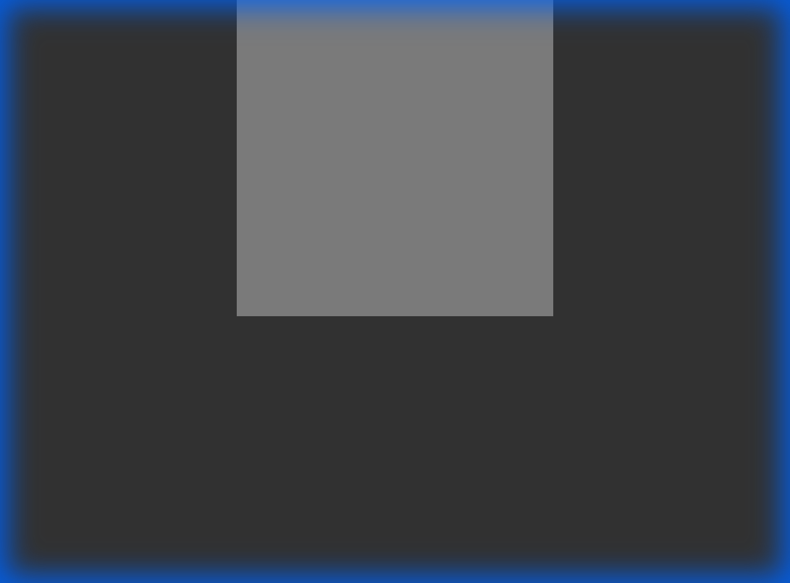
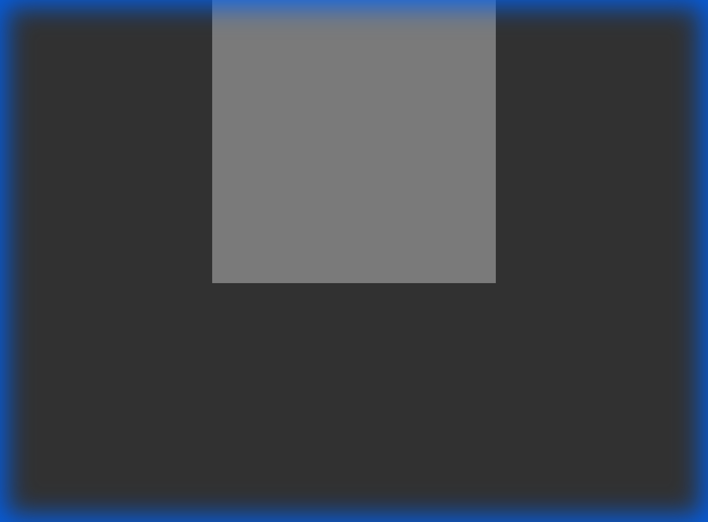
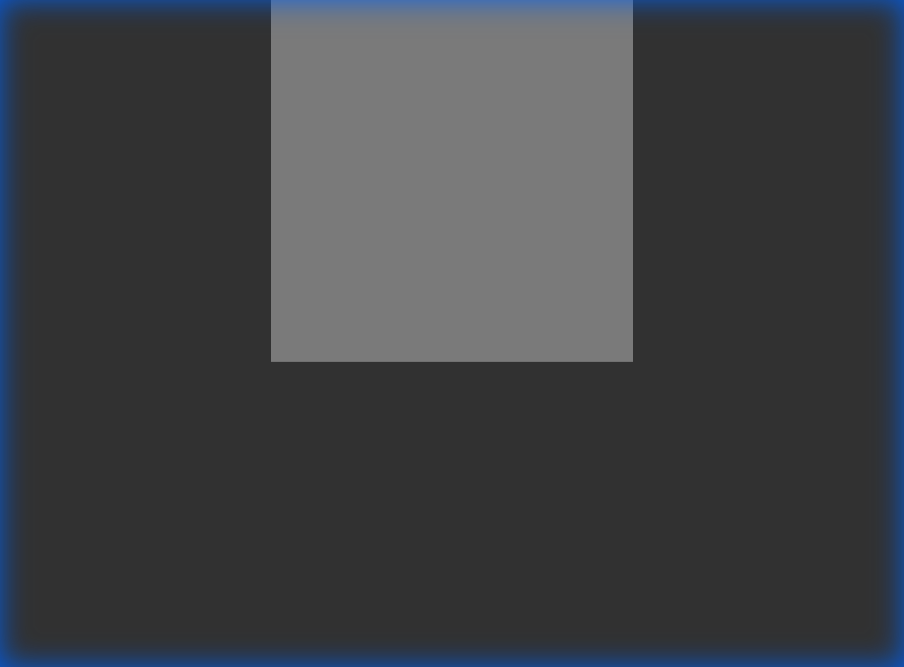

# Project 3: WebGL Shaders

This project demonstrates procedural shape generation using WebGL vertex and fragment shaders. Each version builds progressively on the previous one.

## Versions

### 
**Version 1: Wireframe Triangle**

A simple equilateral triangle created procedurally using trigonometry in the vertex shader. Rendered as a yellow line loop.

**Key Concepts:**
- Basic vertex shader with procedural geometry
- Computing vertex positions using `cos()` and `sin()`
- Fragment shader with flat color

---

### 
**Version 2: 10-Sided Filled Polygon**

A filled 10-sided polygon created using a triangle fan primitive.

**Key Concepts:**
- Triangle fan rendering (`gl.TRIANGLE_FAN`)
- Uniform variables to pass data to shaders
- Scaling vertex count with the `N` uniform

---

###  
**Version 3: Five-Pointed Star**

A classic five-pointed star created by modulating vertex radius based on even/odd vertex IDs.

**Key Concepts:**
- Radius modulation based on vertex ID
- Even vertices at full radius (outer points)
- Odd vertices at reduced radius (inner points, 0.4)
- Explicit handling of center vertex

---

### 
**Version 4: Rotating Star**

The five-pointed star now rotates continuously using animation.

**Key Concepts:**
- Time-based animation using `requestAnimationFrame()`
- Time uniform variable (`t`) passed to shader
- Incorporating time into angle computation for rotation

---

### 
**Version 5: Colored Rotating Star (Extra Credit)**

The rotating star with beautiful color interpolation from gold center to deep red edges.

**Key Concepts:**
- Shader variable export/import (`out` from vertex, `in` to fragment)
- Color interpolation using `mix()` function
- Radius-based color gradient

---

## Technical Implementation

### Shader Pipeline
- **Vertex Shader**: Generates vertex positions procedurally using trigonometry and time-based transformations
- **Fragment Shader**: Handles coloring, from simple flat colors to interpolated gradients

### Progressive Development
Each version adds new concepts while maintaining the foundation:
1. Basic procedural geometry → 2. Uniform variables → 3. Conditional logic → 4. Animation → 5. Inter-shader communication

## Files
- `initShaders.js` - Helper function for compiling and linking shaders
- `v1-triangle.html` - Wireframe triangle
- `v2-polygon.html` - 10-sided polygon
- `v3-star.html` - Five-pointed star
- `v4-rotating-star.html` - Animated rotating star
- `v5-colored-star.html` - Colored animated star (extra credit)

## Running the Applications
Simply open any HTML file in a WebGL 2.0 capable browser. No web server required for these simple applications.
